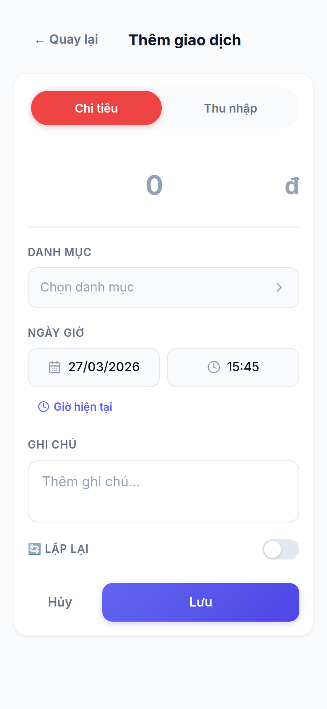
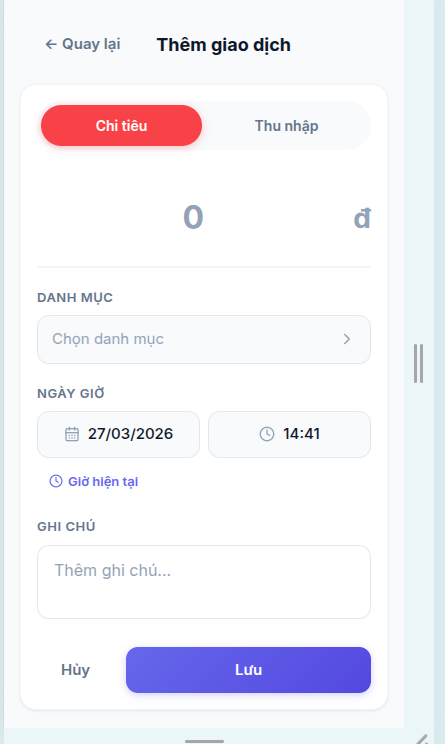
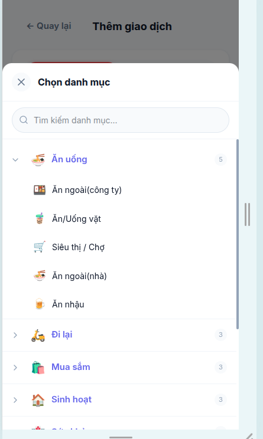
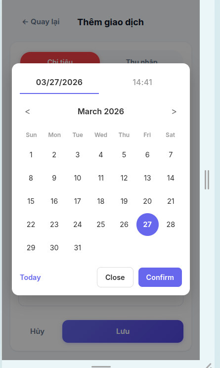
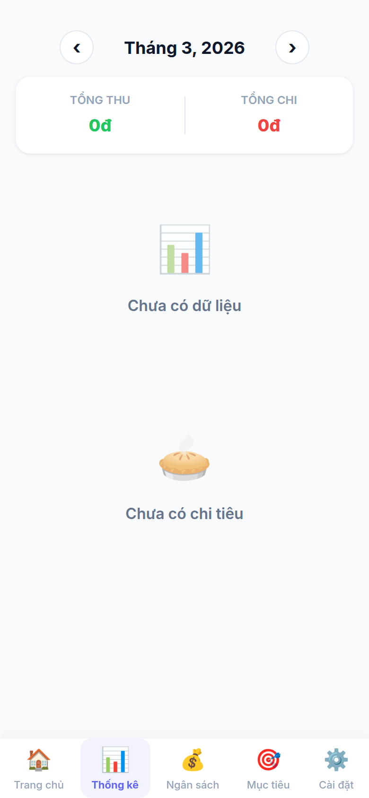
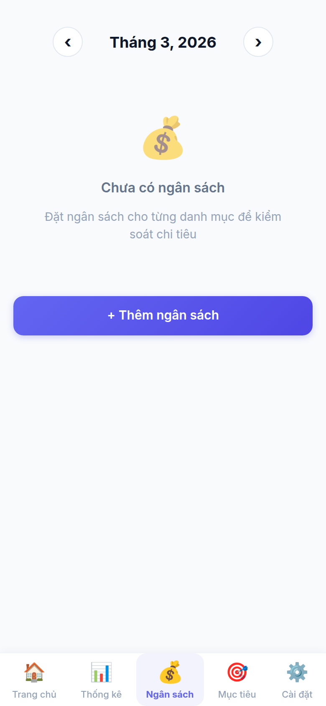
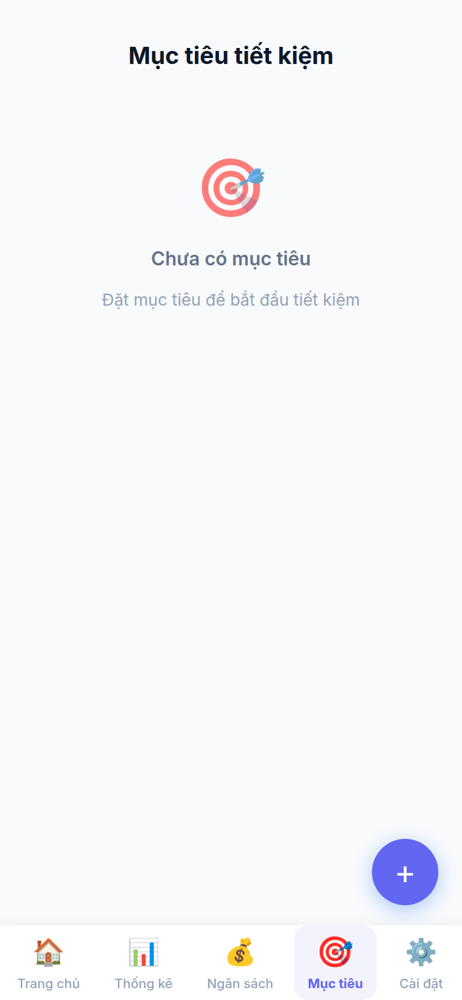
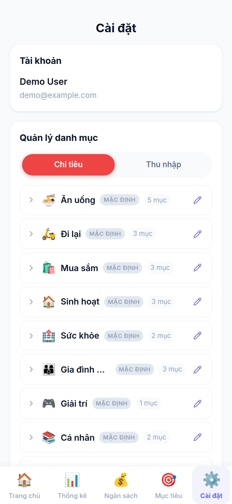
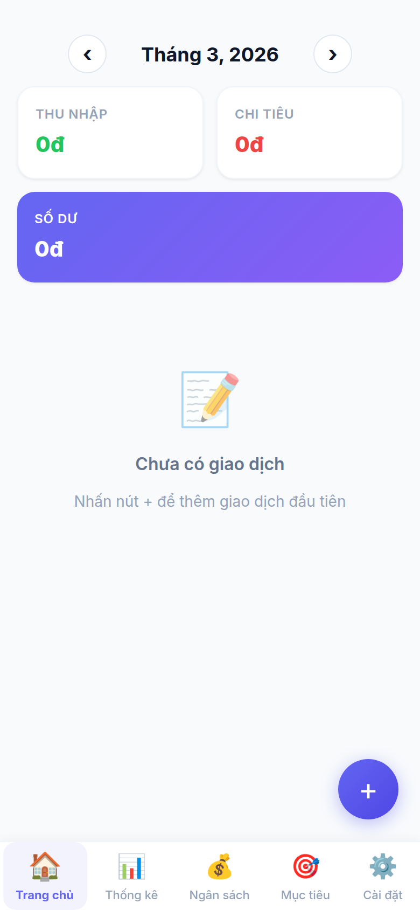

# Chi Tiêu Cá Nhân

Ứng dụng quản lý tài chính cá nhân dành cho người Việt — theo dõi thu chi, lập ngân sách, đặt mục tiêu tiết kiệm.

**Stack:** React 19 · Vite · Tailwind CSS 4 · Firebase (Firestore + Google Auth) · Recharts · PWA

---

## 📸 Screenshots

### Trang chủ

Xem tổng quan thu nhập, chi tiêu và số dư theo tháng. Danh sách giao dịch nhóm theo ngày.

<p align="center">
  
</p>

---

### Thêm giao dịch

Form nhập giao dịch với chọn danh mục, ngày/giờ, ghi chú, gợi ý danh mục thông minh và tuỳ chọn lặp lại định kỳ.

<p align="center">
  
  &nbsp;&nbsp;
  
</p>

<p align="center">
  
  &nbsp;&nbsp;
  
</p>

---

### Thống kê

Biểu đồ cột theo tháng, biểu đồ tròn theo danh mục, so sánh tháng trước, top giao dịch và phân tích theo ngày trong tuần.

<p align="center">
  
</p>

---

### Ngân sách

Đặt hạn mức chi tiêu theo từng danh mục, theo dõi tiến độ theo thời gian thực, cảnh báo khi vượt ngân sách.

<p align="center">
  
</p>

---

### Mục tiêu tiết kiệm

Tạo mục tiêu tiết kiệm, nạp tiền vào mục tiêu và theo dõi tiến độ đến khi hoàn thành.

<p align="center">
  
</p>

---

### Cài đặt

Quản lý tài khoản, tuỳ chỉnh danh mục, cấu hình giao dịch định kỳ và xuất dữ liệu Excel.

<p align="center">
  
</p>

---

### Đăng nhập

<p align="center">
  
</p>

---

## Tính năng chính

- **Quản lý thu chi** — thêm, sửa, xoá giao dịch; phân loại 2 cấp (danh mục cha / con)
- **Bàn phím máy tính** — nhập số tiền với phép tính (+, -, ×, ÷), hỗ trợ số thập phân
- **Gợi ý danh mục thông minh** — phân tích lịch sử 30 ngày + khung giờ để gợi ý top 3
- **Đính kèm hình ảnh** — chụp hoá đơn/biên lai, upload lên Cloudinary, xem ảnh full-size với lightbox
- **Ngân sách theo tháng** — đặt hạn mức theo danh mục, cảnh báo khi gần/vượt ngân sách (hiển thị badge trên nav)
- **Mục tiêu tiết kiệm** — đặt mục tiêu và nạp tiền từng phần, theo dõi tiến độ
- **Giao dịch định kỳ** — tự động tạo giao dịch theo lịch hàng ngày/tuần/tháng/năm
- **Chia giao dịch** — split một giao dịch thành nhiều danh mục khác nhau
- **Thống kê nâng cao** — biểu đồ tròn theo danh mục, biểu đồ cột theo tháng, phân tích theo ngày trong tuần, so sánh tháng trước, dự báo dòng tiền, top giao dịch lớn nhất
- **Insights** — phân tích chi tiêu tự động với các gợi ý cải thiện
- **Xuất Excel** — export giao dịch ra file `.xlsx`
- **PWA** — cài đặt như app native trên điện thoại, hỗ trợ offline

---

## Cài đặt & chạy

```bash
# Clone và cài dependencies
npm install

# Tạo file .env từ mẫu và điền Firebase credentials
cp .env.example .env

# Chạy dev server
npm run dev

# Build production
npm run build
```

### Cấu hình Firebase & Cloudinary

Tạo project Firebase tại [console.firebase.google.com](https://console.firebase.google.com), bật **Firestore** và **Google Auth**. Tạo tài khoản Cloudinary tại [cloudinary.com](https://cloudinary.com) để lưu trữ hình ảnh.

Điền vào `.env`:

```
VITE_FIREBASE_API_KEY=
VITE_FIREBASE_AUTH_DOMAIN=
VITE_FIREBASE_PROJECT_ID=
VITE_FIREBASE_STORAGE_BUCKET=
VITE_FIREBASE_MESSAGING_SENDER_ID=
VITE_FIREBASE_APP_ID=
VITE_MEASUREMENT_ID=
VITE_CLOUDINARY_CLOUD_NAME=
VITE_CLOUDINARY_UPLOAD_PRESET=
VITE_CLOUDINARY_API_KEY=
VITE_CLOUDINARY_API_SECRET=
```

---

## Cấu trúc dự án

```
src/
├── components/        # UI components (budget, transactions, charts, goals, common, layout)
├── contexts/          # AuthContext (Firebase Google Auth)
├── hooks/             # Custom hooks (useTransactions, useBudget, useCategorySuggestion, ...)
├── pages/             # Page components (HomePage, AddPage, StatsPage, BudgetPage, GoalsPage, SettingsPage)
├── services/          # Firestore CRUD (transactionService, budgetService, recurringService, ...)
├── constants/         # categories.js — hệ thống danh mục 2 cấp
└── utils/             # formatCurrency, dateHelpers, ...
```

### Firestore data model

```
users/{userId}/
  transactions/            { type, amount, categoryId, note, date, createdAt, imageUrl?, [isSplit, splits] }
  budgets/                 { categoryId, amount, month: 'YYYY-MM' }
  categories/              (danh mục tuỳ chỉnh của user)
  recurringTransactions/   { type, amount, categoryId, frequency, nextDueDate, isActive }
  savingsGoals/            { name, targetAmount, currentAmount, deadline }
```
